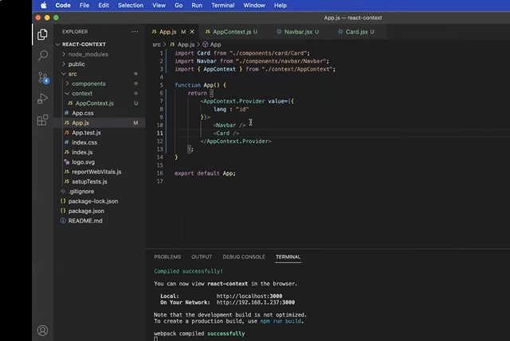
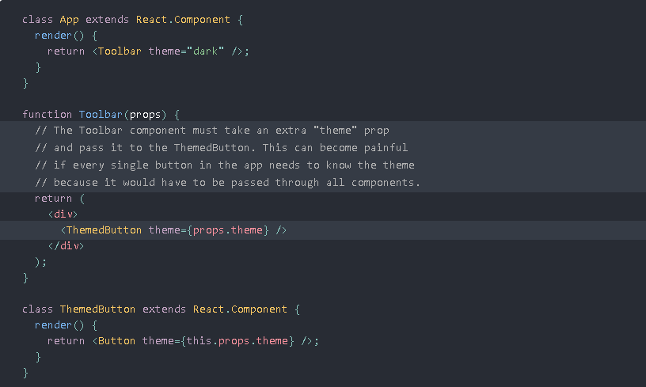
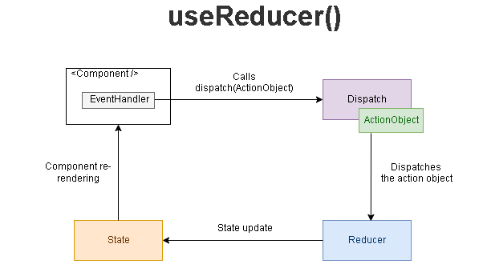

# 29 Agustus 2022 (Redux Thunk)

Adalah  memungkinkan kita memanggil pembuat aksi yang mengembalikan fungsi sebagai ganti objek aksi. Fungsi itu menerima metode pengiriman penyimpanan, yang kemudian digunakan untuk mengirim aksi sinkron di dalam isi fungsi setelah operasi asinkron selesai.

 cara menginstal redux thunk menggunakan printah dibawah ini 

  `npm install redux-thunk@2.3.0`

sedangkan di SRC INDEX.JS masukan printah 

    import React from 'react';
    import ReactDOM from 'react-dom';
    import { Provider } from 'react-redux';
    import { createStore, applyMiddleware } from 'redux';
    import thunk from 'redux-thunk';
    import './index.css';
    import rootReducer from './reducers';
    import App from './App';
    import * as serviceWorker from './serviceWorker';

    // use applyMiddleware to add the thunk middleware to the store const store = createStore(rootReducer, applyMiddleware(thunk));

    ReactDOM.render(
      <Provider store={store}>
        <App />
      </Provider>,
    document.getElementById('root')
    );

Sekarang, Redux Thunk diimpor dan diterapkan di aplikasi Anda.

# 30 Agustus (React Context)
Context bersifat incloude dengan libray react, didalam contextnya hanya membutuhkan provider

## Perbedaan menggunakan Redux dan Context
menggunakan redux codenya terlalu banyak namun ketika menggunakan context codenya lebih simpel dan sedarhana 

di dalam context sendiri juga pada program APP sebagai wadahnya   

berikut printah context sederhana 

perlu kita ketahui ketika membuat context keita tida perlu adanya penginstalan 

<i>jadi kenapa context dilahirkan diakrenakan context di design untuk melakukan shering data secara global di react components </i>

## Kapan Menggunakan UseContext
dirancang untuk berbagi data yang dapat dianggap "global" untuk pohon komponen React, seperti pengguna yang diautentikasi saat ini, tema, atau bahasa pilihan. Misalnya, dalam kode di bawah ini kita secara manual memasukkan prop "tema" untuk menata komponen Tombol:

Dengan menggunakan konteks, kita dapat menghindari melewatkan props melalui elemen perantara:

# 31 Agustus 2022 (usereduser)
 digunakan untuk menyimpan dan memperbarui state, sama seperti useState Hook. Ia menerima fungsi reducer sebagai parameter pertama dan state awal sebagai yang kedua.
 

useReducer mengembalikan array yang menyimpan nilai state saat ini dan fungsi dispatch, yang dapat diberikan tindakan dan lalu dipanggil lagi. Ini mirip dengan pola yang digunakan Redux tapi beda dikit

Sebagai keterangan, ada tiga blok bangunan utama di Redux:
- store — objek yang tidak dapat diubah (immutable) yang menyimpan data state aplikasi
- reducer — fungsi yang mengembalikan beberapa data state, dipicu oleh aksi type
- action — objek yang memberi tahu reducer cara mengubah state. Harus berisi properti type, dan dapat berisi properti payload secara opsional

useReducer(reducer, initialState)Hook menerima 2 argumen: fungsi reducer dan status awal . Hook kemudian mengembalikan array 2 item: status saat ini dan fungsi pengiriman .

        import { useReducer } from 'react';

    function MyComponent() {
            const [state, dispatch] = useReduc(reducer, initialState);
            const action = {
                type: 'ActionType'
            };
            return (
    <button onClick={() => dispatch(action)}>
      Click me
    </button>
     );
     }

inilah cara kerja pembaruan (update) status menggunakan reducer.

Sebagai hasil dari pengendali peristiwa atau setelah menyelesaikan permintaan pengambilan, Anda memanggil fungsi pengiriman dengan objek tindakan .

Kemudian React mengarahkan ulang objek aksi dan nilai status saat ini ke fungsi reducer

Fungsi reducer menggunakan objek tindakan dan melakukan pembaruan status, mengembalikan status baru.

Bereaksi kemudian memeriksa apakah keadaan baru berbeda dari yang sebelumnya. Jika status telah diperbarui, React merender ulang komponen dan useReducer() mengembalikan nilai status baru: [newState, ...] = useReducer(...).

Perhatikan bahwa useReducer()desain didasarkan pada arsitektur Flux

# unit testing
bisa di lakukan oleh progremernya secara langsung  dengan tujuam : mencari kesalahan pada progremernya dengan adanya unit testing ini 